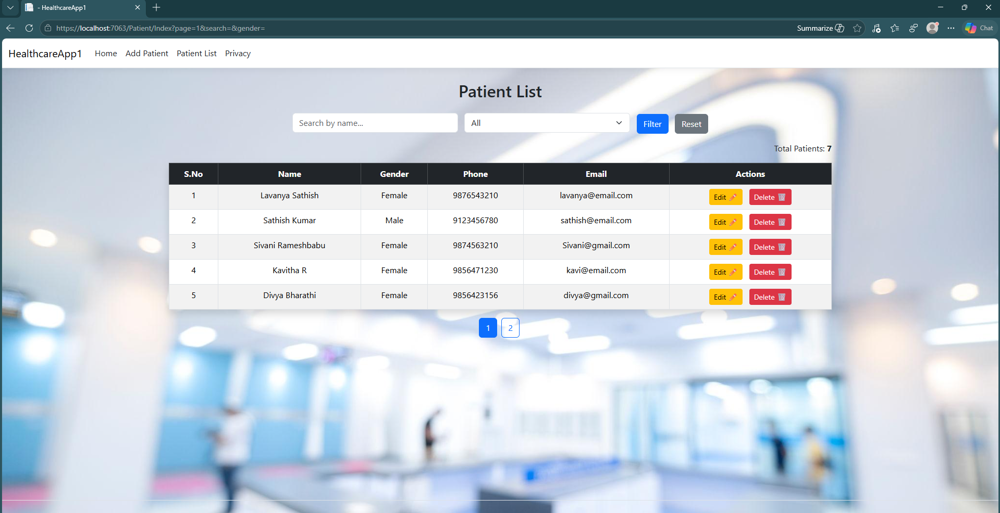
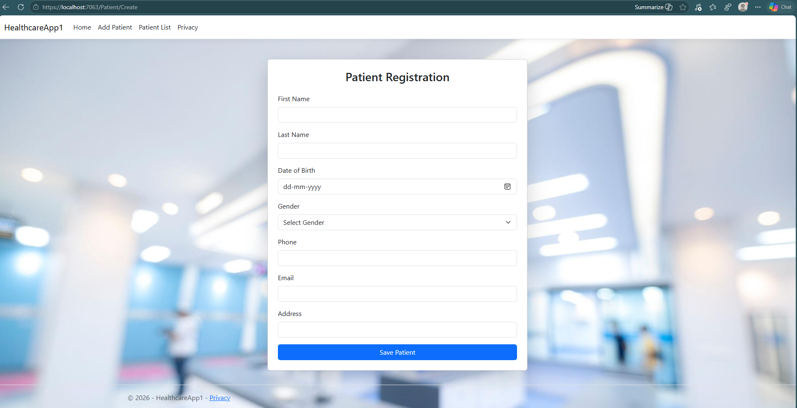
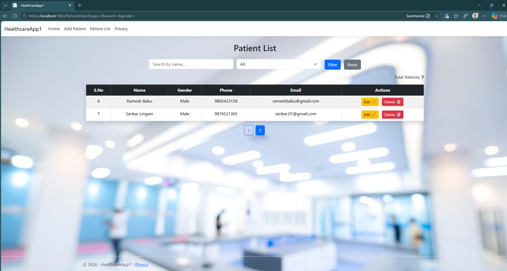

# 🏥 Healthcare Patient Management System

A web application built using ASP.NET Core MVC to manage patient records efficiently.

---

## 🚀 Features

- Add, Edit, Delete Patients (CRUD)
- Search patients by name
- Filter by gender
- Server-side pagination (SQL OFFSET-FETCH)
- Responsive UI using Bootstrap

---

## 🛠 Tech Stack

- ASP.NET Core MVC
- SQL Server
- ADO.NET
- Bootstrap

---

## 📌 How to Run

1. Clone the repository
2. Open in Visual Studio
3. Update connection string in `appsettings.json`
4. Run the project

---

## 📸 Screenshots

---

## 💡 Key Highlights

- Implemented pagination using OFFSET-FETCH
- Used parameterized queries (SQL Injection safe)
- Clean MVC architecture

---

## 🔗 GitHub Link

https://github.com/Lavanya-rameshbabu/Healthcare-Patient-Management